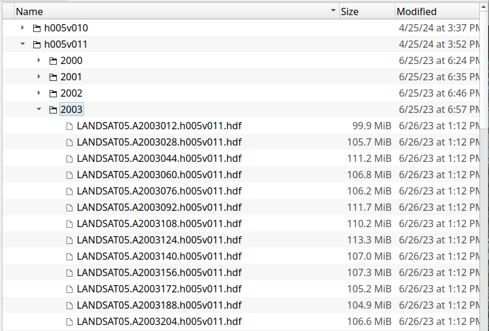
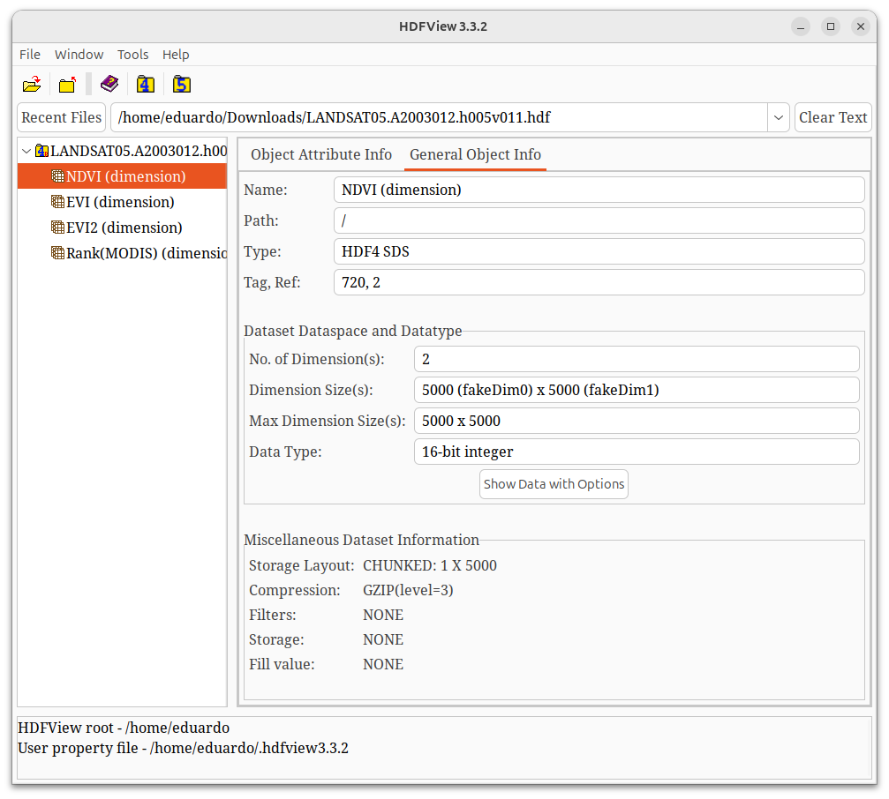
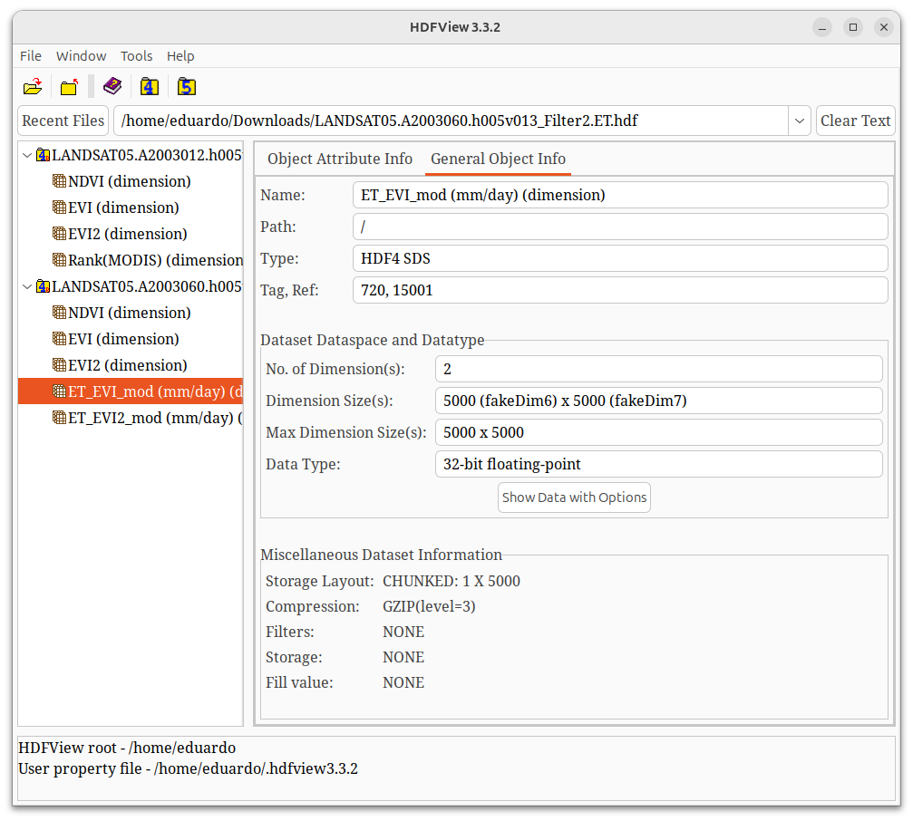
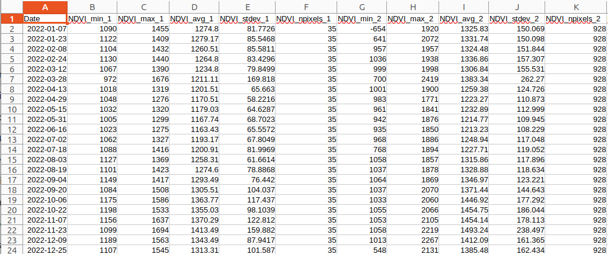

# ts

ts - time series utilities for HDF4 and HDF5 data

# Usage

```
ts --help

Options:
  -d, --dir PATH              Specify directory to proceess files
  -f, --format FORMAT         Specify HDF format: hdf4 or hdf5 (default: hdf4)
  -s, --subdirs SUBDIRS       Comma-separated list of subdirectories under --dir
                              scans each <dir>/<subdir> (e.g. -s 2011,2012)
  -m, --mask FILE             Specify a mask file (only HDF4 currently supported)
  -V, --values VALUES         Comma-separated list of mask values (default: 1) to extract from datasets
  -l, --lower VALUE           Exclude values less than VALUE from analysis and stats (default: -9999)
  -u, --upper VALUE           Exclude values greater than VALUE from analysis and stats (default: 20000)
  -r, --ranges VALUE          Specify the valid ranges for each dataset, otherwise use values from -u -l
                              format is DS:VMIN:VMAX comma separated (e.g. NDVI:-2000:10000,ET:0.1:20)
  -o, --output FILE           Output CSV file to save the time series statistics
  -v, --version               Show version information
  -h, --help                  Show this help message
```

## File organization expected

Scan directories in the structure `root/main_dir/subdirs`.



If no subdirs specified only the `main_dir` will be scanned, `subdirs` should be named by year or any other period.
`subdirs` are going to be sorted by file name only, not by date. Thus name should match time period.

The time for the time series will be taken from the filename, a structure AYYYYDOY
is expected, when `A` is the char 'A', `YYYY` is the year and `DOY` the day-of-year (1-366). For example:

```LANDSAT05.A2003012.h005v011```

The date will be 2003-012 and transformed to Jan 12, 2000 in ISO format 2000-01-12.

## HDF4 structure



When dataset names include character names use the `\` scape char. In the image the dataset name is `ET_EVI2_mod (mm/day)` which contain these characters:



This is handled by using the scape char for the blank space, open parenthesis and close parenthesis: `\ `, `\(` and `\)`. See examples below.

## Resulting CSV file

The file will contain headers with the `Date` in the first column and next the column names will be `{DATASET}_{STAT}_{MASKVALUE}`, for example dataset `NDVI` for the `average` statistic and the mask value `1` will be: `NDVI_avg_1`, and so on. The number of columns result from the combination of datasets, statistics and mask values.



## Examples


```./ts -d /mnt/vipdata/Documents/TestTimeSeries/DATA/h005v010 -s 2022 -m /mnt/vipdata/Documents/TestTimeSeries/DATA/MASKS/river_groups.hdf -V 1,2,3 -o /mnt/vipdata/Documents/TestTimeSeries/file5.csv```

For weird characters in filename blank spaces or parenthesis:

```./ts -d /mnt/vipdata/Documents/TestTimeSeries/DATA/ET/h007v013 -s 2023,2024 -m /mnt/vipdata/Documents/TestTimeSeries/DATA/MASKS/river_groups.hdf -V 1,2,3 -o /mnt/vipdata/Documents/TestTimeSeries/file4.csv -r NDVI:-2000:10000,EVI:-2000:10000,ET_EVI2_mod\ \(mm/day\):0.1:20```

# Author

Copyright (C) 2025 Eduardo Jimenez Hernandez <eduardojh@arizona.edu>.

# License

License GPLv3+: GNU GPL version 3 or later <https://gnu.org/licenses/gpl.html>.
This is free software: you are free to change and redistribute it.
here is NO WARRANTY, to the extent permitted by law.